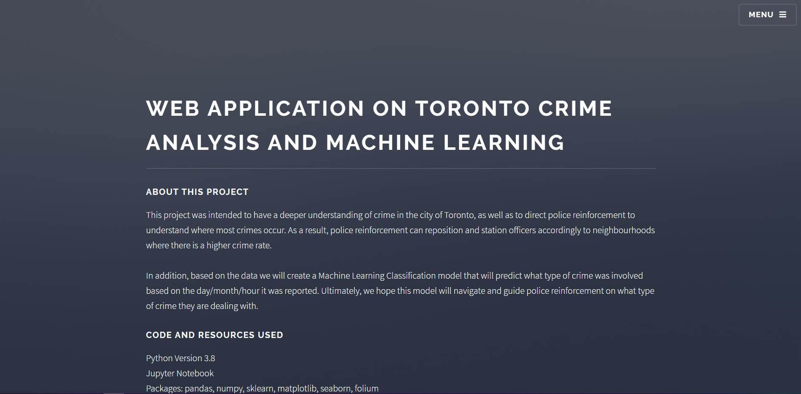

# Toronto Crime Analysis and Machine Learning
The webapp for this project can be viewed [here](https://trtcrimeanalysis.netlify.app/)

## Background
- This project was intended to have a deeper understanding of crime in the city of Toronto. In addition, it was intended to direct police reinforcement to understand where most crimes occur. As a result, police reinforcement can reposition and station officers accordingly to neighbourhoods where there is a higher crime rate.
- In addition, based on the data we will create a Machine Learning Classification model that will predict the type of crime that was involved based on the day/month/hour it was reported. Ultimately, we hope this model will navigate and guide police reinforcement on what type of crime they are dealing with.
# Code and Resources Used
- Python Version 3.8
- Jupyter Notebook
- Packages: pandas, numpy, sklearn, matplotlib, seaborn, folium
# The Dataset
- Utilizing Toronto Police's API we were able to gather the dataset [here](https://data.torontopolice.on.ca/pages/open-data).
	- OBJECTID: unique ID code for each row
	- Neighbourhood: Neighbourhood name in Toronto
	- Hood_ID: unique ID for each neighbourhood
	- Population: population in each respective neighbourhood
	- Assault_XXXX: The number of assaults in the respective neighbourhood for each year
	- Assault_AVG: The average number of assaults in the respective neighbourhood
	- AutoTheft_XXXX: The number of auto thefts in the respective neighbourhood for each year
	- AutoTheft_AVG: The average number of auto thefts in the respective neighbourhood
	- BreakandEnter_XXXX: The number of Break and Enters (B&Es) in the respective neighbourhood for each year
	- BreakandEnter_AVG: The average number of B&Es in the respective neighbourhood
	- Homicide_XXXX: The number of homicides in the respective neighbourhood for each year
	- Homicide_AVG: The average number of homicides in the respective neighbourhood
	- Robbery_XXXX: The number of robberies in the respective neighbourhood for each year
	- Robbery_AVG: The average number of robberies in the respective neighbourhood
	- TheftOver_XXXX: The number of theft (>$5000)in the respective neighbourhood for each year
	- TheftOver_AVG: The average number of thefts (>$5000) in the respective neighbourhood
	- Shape_Area: Area of each neighbourhood
	- Shape_Length: Length of each neighbourhood
# Findings
### Summary Statistics
 
Here are some summary statistics for the crimes involved in the city of Toronto according to the Toronto Police dataset. As you can see above, there seems to be a growing trend throughout the years in some of the crimes involved. Thefts, Auto Thefts, and Assaults per year seem to be at a growing rate every year from 2014. 

 
Next we decided to look at the crimes committed vs. the population of the neighbourhood to answer the question whether or not population count influenced more crimes committed. From analyzing the scatterplots, there doesn't seem to be a direct correlation between the population size and number of crimes committed. We are able to confirm this later by conducting a T-Test.

### Geographic Statistics
Lastly, we can view the geographical statistics for crimes on a map of Toronto. A choropleth map of the assaults and thefts in Toronto can be seen below:

From this map, we can see the darker purple colour indicates a higher amount of crimes involved. The neighbourhood of West Humber-Clairville and Waterfront Communities have the highest amount of thefts reported.

From this map, we can see the darker purple colour indicates a higher amount of crimes involved. The neighbourhood of Waterfront Communities have the highest amount of assaults reported.

# Usage 
This project is best viewed in a notebook viewer, which can be accessed [here](https://nbviewer.jupyter.org/github/jason-huynh83/Toronto-Crime/blob/master/Toronto_Crime.ipynb) as there are plotly graphs that are not shown.
